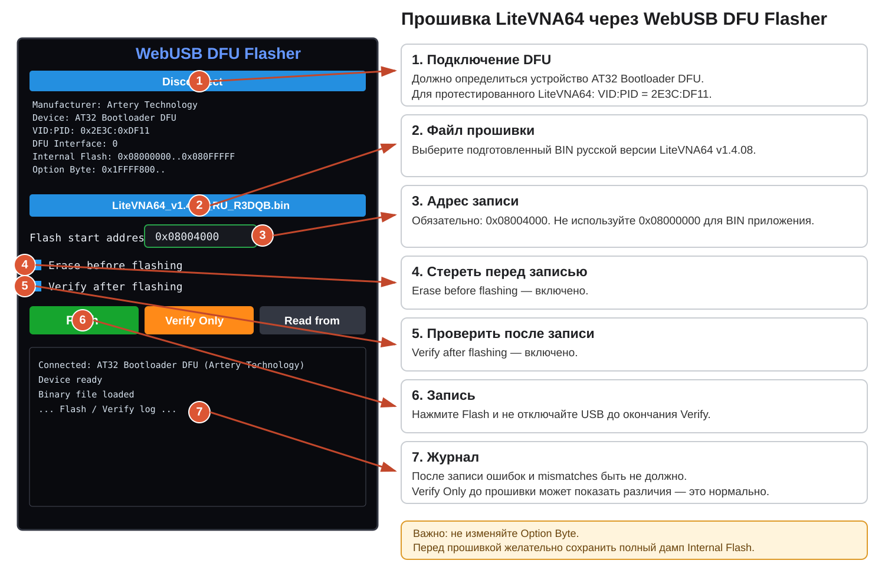

# Прошивка LiteVNA64

Эта инструкция описывает прошивку русской локализации **LiteVNA64 v1.4.08** через браузерный **WebUSB DFU Flasher**.

> **Проверено на:** Zeenko ZN-406 / LiteVNA64, HW 64-0.3.3, загрузчик AT32 DFU.

## Что понадобится

- LiteVNA64;
- USB-кабель **с передачей данных**;
- компьютер с Windows, Linux или macOS;
- браузер на Chromium: **Google Chrome** или **Microsoft Edge**;
- подготовленный файл русской прошивки;
- на Windows — рабочий USB DFU/WinUSB-драйвер для AT32.

## 1. Подготовьте русскую прошивку

Получите официальный `LiteVNA64 v1.4.08.bin` и создайте русскую версию патчером из этого репозитория:

```bash
python patcher/patch_litevna_ru.py "LiteVNA64 v1.4.08.bin"
```

Ожидаемый SHA-256 исходного файла:

```text
22f91d4769b81b058343ad94055cbd94a2cffbc7e0378619a94d6abfc515d501
```

Ожидаемый SHA-256 результата:

```text
67fa2538b87730aa74aef6517d99aca834eee58ea4e4d26d01952f74c88f7516
```

Патчер не применит изменения к неизвестной версии BIN.

## 2. Установите драйвер DFU в Windows

Если после перевода LiteVNA в режим загрузчика Windows показывает **AT32 Bootloader DFU** с жёлтым значком ошибки, сначала установите драйвер.

Для AT32 производитель Artery предоставляет программу **Artery_DFU_DriverInstall.exe**. Она входит в официальный пакет **ISP Programmer**.

- официальный раздел Artery с инструментами:  
  https://arterytek.com/en/support/tools.jsp?index=3
- выберите **ISP Programmer**;
- в распакованном комплекте найдите `Artery_DFU_DriverInstall.exe`;
- запустите от имени администратора;
- подключите LiteVNA в DFU;
- нажмите **Install driver**;
- если автоматическая установка не сработала, используйте **Extract driver** и установите полученный драйвер вручную через Диспетчер устройств.

Для сверки: предоставленный при подготовке проекта установщик имел:

```text
Имя: Artery_DFU_DriverInstall.exe
Размер: 9 735 168 байт
SHA-256: 9d3001bb2abe1228cdfa23a10b2b37a0196cf5d781b0075a63d9019c38a56e59
```

Дополнительный вариант для Windows — установить **WinUSB** через Zadig. Именно WinUSB рекомендует автор WebUSB DFU Flasher, если браузер выдаёт `Access denied`.

> DFU-режим **не обязан появляться как COM-порт**. Нормально, если `AT32 Bootloader DFU` отображается в Диспетчере устройств как USB-устройство.

Дополнительная информация: [drivers/README.md](../drivers/README.md).

## 3. Переведите LiteVNA в режим обновления прошивки

Есть два штатных способа.

### Способ A — кнопкой/энкодером

1. Выключите LiteVNA.
2. Нажмите и удерживайте Jog/многофункциональный переключатель.
3. Не отпуская его, включите питание.
4. Прибор войдёт в режим обновления.

В этом режиме экран может оставаться чёрным — это нормально.

### Способ B — через меню

В оригинальном интерфейсе:

```text
CONFIG → BOOTLOAD → RESET AND ENTER
```

В русской локализации соответствующий пункт называется **РЕЖИМ DFU**.

## 4. Проверьте устройство в Windows

В Диспетчере устройств должно появиться устройство примерно с такими параметрами:

```text
Manufacturer: Artery Technology
Device: AT32 Bootloader DFU
VID:PID: 0x2E3C:0xDF11
DFU Interface: 0
Internal Flash: 0x08000000..0x080FFFFF
```

Если устройство не появляется:

- попробуйте другой USB-кабель;
- используйте другой USB-порт;
- повторно войдите в DFU;
- переустановите DFU/WinUSB-драйвер.

## 5. Откройте WebUSB DFU Flasher

Используйте страницу автора прошивок DiSlord:

**https://dislord.github.io/WebUSB-DFU-Flasher/webusb_dfu.html**

Исходный код инструмента:

**https://github.com/DiSlord/WebUSB-DFU-Flasher**

Рекомендуется Chrome или Edge.

## 6. Подключитесь к загрузчику

1. Нажмите **Connect**.
2. Браузер покажет системное окно выбора USB-устройства.
3. Выберите **AT32 Bootloader DFU**.
4. После подключения проверьте, что Flasher показывает:
   - Manufacturer: Artery Technology;
   - Device: AT32 Bootloader DFU;
   - VID:PID: `2E3C:DF11`;
   - Internal Flash `0x08000000..0x080FFFFF`.

Если браузер не предлагает устройство или пишет `Access denied`, проблема обычно в драйвере Windows.

## 7. Рекомендуется сделать резервную копию

WebUSB DFU Flasher умеет читать Flash обратно из устройства.

1. Нажмите **Read from** / **Upload from Device**.
2. Выберите диапазон внутренней Flash.
3. Для полной резервной копии используйте всю область:
   - начало: `0x08000000`;
   - конец: `0x080FFFFF`;
   - размер: **1 MiB**.
4. Считайте данные.
5. Сохраните результат как BIN и уберите его в надёжное место.

> Не изменяйте **Option Byte**. Для обычной прошивки русской локализации это не требуется.

## 8. Загрузите BIN русской версии

Нажмите поле выбора файла и укажите:

```text
LiteVNA64_v1.4.08_RU_R3DQB.bin
```

Для сырого файла `.bin` WebUSB Flasher не знает адрес автоматически — его нужно указать вручную.

## 9. Укажите адрес записи — это критически важно

В поле **Flash start address** обязательно установите:

```text
0x08004000
```

**Не оставляйте `0x08000000`.**

`0x08004000` — адрес начала приложения LiteVNA64. Область перед ним относится к загрузчику/служебной части и не должна перезаписываться этим BIN.

## 10. Выставьте параметры

Должно быть:

```text
Flash start address:    0x08004000
Erase before flashing: ON
Verify after flashing: ON
```

## 11. Нажмите Flash

1. Нажмите зелёную кнопку **Flash**.
2. Не выключайте LiteVNA.
3. Не выдёргивайте USB-кабель.
4. Дождитесь завершения записи.
5. Дождитесь автоматического Verify.

После успешной прошивки проверка должна завершиться без несовпадений.

### Что означает Verify Only

`Verify Only` **ничего не записывает** — он лишь сравнивает выбранный BIN с содержимым Flash.

Поэтому если **до прошивки** выбрать русский BIN и нажать Verify Only на приборе со старой/оригинальной прошивкой, большое число `mismatches` — нормально.

**После Flash** mismatches быть не должно.

## 12. Перезагрузите прибор

После успешной записи и Verify:

1. нажмите **Disconnect**;
2. отключите USB при необходимости;
3. выключите и снова включите LiteVNA.

После запуска должен появиться русский интерфейс.

## Наглядная схема



## Типичные проблемы

### AT32 Bootloader DFU виден с ошибкой драйвера

Установите Artery DFU Driver или WinUSB. Затем отключите и снова подключите прибор.

### Устройства нет в списке Connect

Проверьте:

- действительно ли LiteVNA в DFU;
- USB-кабель;
- USB-порт;
- драйвер;
- используется ли Chrome/Edge.

### `Access denied`

На Windows обычно означает, что для DFU-устройства не установлен подходящий WinUSB-драйвер.

### После Verify Only тысячи mismatches

Если прошивка **ещё не записывалась**, это нормально: вы сравниваете два разных образа.

Если mismatches появились **после Flash**, прошивку считать успешной нельзя. Не перезагружайте прибор вслепую — повторите запись и проверьте соединение.

### Прибор не запускается после записи

Если AT32 Bootloader DFU по-прежнему доступен:

1. снова войдите в DFU;
2. загрузите оригинальный BIN;
3. укажите адрес `0x08004000`;
4. включите Erase и Verify;
5. восстановите оригинальную прошивку.

## Короткая памятка

```text
DFU device:             AT32 Bootloader DFU
VID:PID:                2E3C:DF11
Web flasher:            dislord.github.io/WebUSB-DFU-Flasher/webusb_dfu.html
BIN start address:      0x08004000
Erase before flashing:  ON
Verify after flashing:  ON
Option Byte:             НЕ ТРОГАТЬ
```
